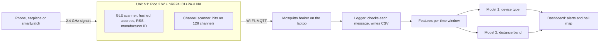

<p align="center">
  <picture>
    <source media="(prefers-color-scheme: dark)" srcset="docs/brand/logo/invigil-logo-dark.svg">
    
  </picture>
</p>

Invigil finds hidden phones, Bluetooth earpieces and smartwatches in an exam hall by listening to the 2.4 GHz radio band, without transmitting anything.

*Every signal leaves a trace.*

[](https://github.com/mohanvd/invigil/actions/workflows/ci.yml)
[](LICENSE)

## What it does

One sensor unit sits at the edge of a 6-seat mini exam hall. It is a Raspberry Pi Pico 2 W with an nRF24L01+PA+LNA radio, and it listens in two ways:

- **BLE scanner.** The Pico's own radio hears Bluetooth Low Energy advertisements and reads the signal strength (RSSI) and the manufacturer ID. The address is hashed on the unit.
- **Channel scanner.** The nRF24L01 sweeps 126 channels of the 2.4 GHz band and counts where it hears a carrier. Bluetooth audio shows up as scattered hits across the band because it hops between channels. Wi-Fi shows up as fixed blocks.

The unit sends its readings over Wi-Fi with MQTT to a laptop. On the laptop, a model answers two questions about each device:

1. **Device type:** phone, earpiece, smartwatch, or allowed (a proctor's device).
2. **Distance band from the unit:** near (under 1 m), mid (1 to 2 m), or far (2 to 3.5 m).



The message formats are in the [MQTT contract](docs/contract.md).

## Status

Invigil is a Grade 12 school capstone and a work in progress. **The hardware is not built yet**, so nothing here has been tested against real devices, and no accuracy or range figure exists yet.

What works today, on a laptop with no hardware:

- **Logger** (`server/logger.py`): subscribes to the unit's topics, checks every message against the contract, and writes valid readings to CSV.
- **Fake publisher** (`server/fake_publisher.py`): stands in for the unit and publishes readings in the right format. The numbers are placeholders, not physics.
- **ML pipeline** (`ml/`): turns logged sessions into features, trains both models, and tests them on held-out sessions. It has only been run on synthetic data, which proves the code runs and nothing more.
- **Tests** for the contract, the logger, the fake publisher and the ML pipeline.

Not started: the firmware, the dashboard and the digital twin.

## Hardware

| Part | Quantity | Used for | Price (EGP) |
| --- | --- | --- | --- |
| Raspberry Pi Pico 2 W (RP2350 + CYW43439) | 1 | Main board, BLE scanner, Wi-Fi | TBD |
| nRF24L01+PA+LNA module with antenna | 1 | 2.4 GHz channel scanner, receive only | TBD |
| 100 uF electrolytic capacitor | 1 | Steadies the radio's supply | TBD |
| Breadboard and jumper wires | 1 set | Wiring | TBD |
| Micro USB cable | 1 | Power and flashing | TBD |
| USB power bank or 5 V adapter | 1 | Power in the hall | TBD |
| **Total** | | | **TBD** |

Prices will be filled in when the parts are bought. A laptop on the same Wi-Fi network runs the broker, the logger and the models.

### Wiring

Check each pin against the Pico 2 W pinout before soldering.

| nRF24L01+PA+LNA pin | Pico 2 W pin |
| --- | --- |
| VCC | 3V3(OUT). Never 5 V |
| GND | GND |
| SCK | GP18 (SPI0) |
| MOSI | GP19 (SPI0) |
| MISO | GP16 (SPI0) |
| CSN | GP17 |
| CE | GP20 |

Put a 100 uF capacitor across the radio's VCC and GND, close to the module.

## Quick start

You can run the whole laptop side with fake data and no hardware. These commands are for Windows PowerShell, run from the repo root.

1. Install [Python](https://www.python.org/downloads/) 3.11 or newer and [Mosquitto](https://mosquitto.org/download/). The Windows installer adds a Mosquitto service that runs a broker on `localhost:1883`.

2. Create a virtual environment and install the dependencies:

   ```powershell
   python -m venv .venv
   .venv\Scripts\Activate.ps1
   pip install -r requirements.txt
   ```

3. Start the logger in one terminal:

   ```powershell
   python -m server.logger --session fake-test
   ```

4. Start the fake unit in a second terminal (activate the virtual environment there too):

   ```powershell
   python -m server.fake_publisher
   ```

   The logger prints a summary every 10 seconds and writes CSV files to `data/raw/<date>-fake-test/`. Press Ctrl+C in each terminal to stop.

5. Run the tests:

   ```powershell
   python -m pytest
   ```

6. Check the ML pipeline on synthetic sessions:

   ```powershell
   python -m ml.synth
   python -m ml.train --data data/synthetic
   ```

   The score it prints only proves the code runs. Never report it.

**Linux and macOS:** use `python3 -m venv .venv` and `source .venv/bin/activate`. Install Mosquitto with your package manager (`sudo apt install mosquitto` or `brew install mosquitto`) and start it with `mosquitto -v` if it is not already running. Every `python -m ...` command is the same.

More detail:

- [Setup and operation](docs/setup.md): config file, command options, broker setup for the real unit, CSV formats, what the logger rejects.
- [Address hashing](docs/hashing.md): the hashing rule and the test vector the firmware must reproduce.
- [Data collection protocol](docs/data-protocol.md): how to record and label sessions so the accuracy number is honest.
- [Firmware plan](docs/firmware.md): modules and what must be measured on the real unit.

## Repo layout

| Folder | What goes there |
| --- | --- |
| `firmware/` | Pico 2 W unit code (Pico SDK, C, CMake). Not started |
| `server/` | MQTT logger, fake data publisher, later the dashboard API |
| `ml/` | `features.py`, `label.py`, `train.py`, `synth.py` |
| `data/raw/` | Recorded sessions. Gitignored, never committed |
| `data/samples/` | Small anonymized samples that are safe to commit |
| `dashboard/` | Web app: live hall map and alerts. Not started |
| `simulation/` | Digital twin built from real calibration data. Not started |
| `docs/` | Contract, protocols, brand assets, and `results/` for every calibration or test run |

## Design requirements

The prototype is tested against these six requirements. None has been measured yet.

| # | Requirement | Target |
| --- | --- | --- |
| 1 | Response time | At most 5 s from when a device starts transmitting |
| 2 | Device type accuracy | At least 85% on held-out sessions |
| 3 | Distance band accuracy | At least 80% on held-out sessions |
| 4 | Alert latency | Unit to dashboard within 2 s |
| 5 | False alarms | At most 1 per exam hour |
| 6 | Detection range | At least 3 m, covering a 6-seat mini hall |

## Roadmap

Phase 1, one unit:

- [x] MQTT contract, logger and fake publisher
- [x] ML pipeline with held-out session testing
- [ ] Firmware: BLE scanner, channel scanner, Wi-Fi and MQTT link
- [ ] Calibration: signal strength at each distance, sweep timing, thresholds
- [ ] Dataset: about 72 labeled sessions plus a sealed test set
- [ ] Dashboard: live hall map and alerts
- [ ] Digital twin built from the calibration data

Phase 2, later:

- More units, for seat-level location.
- A cellular detector, for phones with Bluetooth off.

## Privacy and responsible use

- **Receive only.** The unit listens. It never transmits to jam, block or interfere with any signal, and this project will not accept code that does.
- **Addresses are hashed.** Every Bluetooth address is salted and hashed (SHA-256, first 12 hex characters) before it touches disk or reaches the dashboard. Raw MAC addresses, audio and packet contents are never stored. See [address hashing](docs/hashing.md).
- **Raw captures stay on the laptop.** `data/raw/` is gitignored. Only anonymized samples are shared.
- **Get permission.** Use Invigil only with the permission of whoever runs the exam, and tell the people in the hall. Do not use it to watch people anywhere else.
- **Follow the law.** Radio monitoring and data protection rules differ between countries. Check the radio and privacy law where you are before you switch it on.
- **It is a detector, not a verdict.** A detection means a radio signal was heard. It does not prove anyone cheated. A person must check before anyone is accused.

To report a privacy or security problem, see [SECURITY.md](SECURITY.md).

## Contributing

Bug reports, ideas and pull requests are welcome. Read [CONTRIBUTING.md](CONTRIBUTING.md) and the [Code of Conduct](CODE_OF_CONDUCT.md) first. To cite the project, use [CITATION.cff](CITATION.cff).

## Team

Team 12323, Alexandria STEM School, Egypt. Grade 12 capstone, 2026-2027.

- Mohanad Tarek
- Ahmed Khalifa
- Ali Hamdeen

## Acknowledgements

To be added: teachers, mentors and everyone who lent a device for testing.

## License

- **Code:** [MIT](LICENSE).
- **Documentation and images in `docs/`:** [Creative Commons Attribution 4.0 International (CC BY 4.0)](https://creativecommons.org/licenses/by/4.0/).
- **The Invigil name and logo:** covered by neither license. You may show them when referring to Invigil. Please do not use them for your own product. See the [brand notes](docs/brand/README.md).
